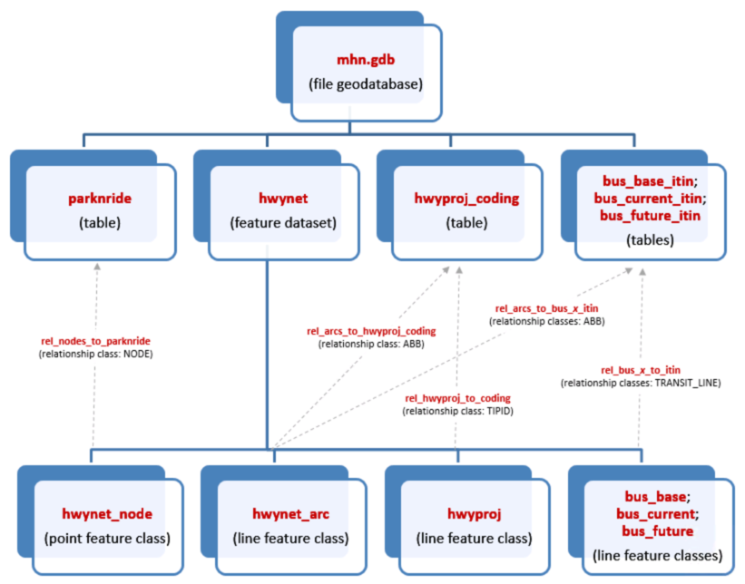

# Master Highway Network Data Structure
The Master Highway Network (MHN) is stored in a file geodatabase, named "mhn.gdb" (or with a year vintage, e.g., "mhn_c26q2.gdb"). This is the second format of the data, upgraded from the obsolete coverage format in July 2013.

The MHN geodatabase stores all of the feature class data needed to build highway networks (and non-rail portions of transit networks) for regional analyses: lines, nodes, highway project coding, and bus routes/itineraries. The structure of the geodatabase is illustrated in the following figure: 

### Figure 1. MHN Data Structure

## Lines (`hwynet_arc`)
Table 1 lists the highway network link variables contained in the **hwynet_arc** attribute table. Variable names ending in "1" describe attributes in the "from-to" direction of the link. Those ending in "2" represent attributes in the opposite direction. When `DIRECTIONS`==2, the attributes ending in "2" are ignored, except applicable `PARKRES2`. When `DIRECTIONS`==3, all variables are explicitly coded. If `BASELINK`==0, only `ANODE`, `BNODE`, `MILES`, and `DIRECITONS` are coded on highway links (with one exception— if `MODES`==4, then `THRULANES1` and `TYPE1` are also coded). Each link in the feature class is defined by a unique `ABB` string (`ANODE`-`BNODE`-`BASELINK`).

### Table 1. `hwynet_arc` field names and descriptions
| Geodatabase Field | Description |
|---|---|
| ANODE | Link's "from" node. |
| BNODE | Link's "to" node. |
| BASELINK | Link description flag: 0 = future project link ("skeleton" link), attributes added via highway project coding 1 = existing network link ("base" link), all attributes present |
| ABB | Unique arc ID, of the form "ANODE-BNODE-BASELINK". Calculated automatically by the Incorporate Edits tool. |
| ROADNAME | Name(s) of the road segment. |
| DIRECTIONS | Link directions flag: 1 = one-way 2 = two-way, attributes in both directions identical 3 = two-way, at least one attribute different in to-from direction |
| TYPE1 & 2 | Facility Type: 1 = Arterial 2 = Freeway (controlled-access) 3 = Freeway-Arterial Ramp 4 = Expressway (limited-access) 5 = Freeway-Freeway Ramp 6 = Centroid Connector 7 = Toll Plaza 8 = Metered Ramp |
| AMPM1 & 2 | Time period restrictions: 1 = open all time periods (1-8) 2 = open a.m. periods only (2-5) 3 = open p.m. periods only (1, 6-8) 4 = open off-peak periods only (1, 5) |
| POSTEDSPEED1 & 2 | Posted speed limit (mph). Data was most recently validated in June 2020 against IRIS and Navteq, with discrepancies compared to Google Maps Street View, with photographs ranging in vintage from roughly 2015-2020. |
| THRULANES1 & 2 | Number of driving lanes. |
| THRULANEWIDTH1 & 2 | Average driving lane width (feet). |
| PARKLANES1 & 2 | Number of on-street parking lanes. |
| PARKRES1 & 2 | Peak period parking restrictions, when on-street parking is not available and an extra through lane is available. Coded separately for each direction on all 2-way links. Code is text string of affected time periods (currently only 3 & 7). Default blank value means no peak period parking restrictions. Data last collected in Spring 2011. |
| SIGIC | Signal interconnect flag: 1 = yes; 0 = no. |
| CLTL | Bi-directional continuous left turn lane flag: 1 = yes; 0 = no. |
| RRGRADECROSS | At-grade railroad crossing flag: 1 = yes; 0 = no. |
| TOLLSYS | Flag for current and future toll system links: 1 = yes; 0 = no. Used for pricing model development. |
| TOLLDOLLARS | Toll amount in dollars for autos with I-PASS. If link type is 7 (toll plaza), this is applied as a fixed-cost toll; for other link types, it is applied as a per-mile rate. |
| MODES | Modes permitted on link: 1 = all vehicles 2 = all vehicles (with truck restrictions from TRUCKRES applied) 3 = trucks only 4 = transit only (only called for transit networks) 5 = HOV only |
| NHSIC | Flag for National Highway System intermodal connector (Illinois only): 1 = yes; 0 = no. Data as of March 2011; used for freight model network development. |
| SRA | Strategic Regional Arterial system route code. Data as of February 2012. |
| CHIBLVD | Flag for Chicago boulevard system: 1 = yes; 0 = no. Data as of July 2013. |
| TRUCKRTE | Truck route code. 1 = Class I IL: approved for all load widths of 8'6" or less. IN: all Interstates and US/state highways. WI: designated long truck route. 2 = Class II IL: approved for all load widths of 8'6" inches or less and a wheel base no greater than 55'. WI: 75' restricted truck route (53' trailer, 43' king pin to rear axle, no double bottoms). 3 = Class III IL: approved for all load widths of 8'0" or less and a wheel base no greater than 55'. WI: 65' restricted truck route (48' trailer, no double bottoms). Data as of March 2011; used for freight model network development; Illinois data include state and local routes. |
| TRUCKRES | Truck restriction code. (Please see S:\AdminGroups\ResearchAnalysis\nmp\Travel_and_Emissions_Model\MHN\Documentation\Truck_Restriction_Codes.xlsx for a listing of all codes.) |
| TRUCKRES_UPDATED | Date of last TRUCKRES update (format: YYMMDD). |
| VCLEARANCE | Overhead clearance (inches). 0 = no restriction or no information; 999 = clearance above legal height (13'6", or 162"), although many links with clearance above 162" do have actual measurements instead of simply '999'. |
| MILES | Link length in miles. (This is the real-world length, not the Euclidean distance of the digitized link, and is calculated automatically by the Incorporate Edits tool.) |
| BEARING | Simple bearing of link in from-to direction (N,NE,E,SE,S,SW,W,NW). Calculated automatically by the Incorporate Edits tool. Used for GTFS coding development. |
| MESO | Meso-freight highway network flag: 1 = included; 0 = excluded. |
| TOLLTYPE | Type of toll represented by TOLLDOLLARS. Calculated automatically by the Incorporate Edits tool. 0 = untolled link 1 = fixed-cost toll (toll plaza links only) 2 = distance-based toll (multiplied by MILES) |

## Nodes `hwynet_node`
Node variables are listed in Table 2. Values for all of these variables are generated automatically either by ArcGIS itself or through the MHN's "Incorporate Edits" tool.

### Table 2. `hwynet_node` field names and descriptions
| Geodatabase Field | Description |
|---|---|
| NODE | CMAP node number. |
| POINT_X | ArcGIS-generated x-coordinate, in NAD 1927 StatePlane Illinois East (feet). |
| POINT_Y | ArcGIS-generated y-coordinate, in NAD 1927 StatePlane Illinois East (feet). |
| subzone17 | Subzone number from CMAP's 2017 subzone system. |
| zone17 | Zone number from CMAP's 2017 zone system. |
| capzone17 | 2017 Capacity zone code: - 1 = Chicago Central Business District (2017 subzones 1-52) - 2 = Remainder of Chicago Central Area (2017 subzones 53-84) - 3 = Remainder of City of Chicago (2017 subzones 85-983 & 3896-3904) - 4 = Inner ring suburbs where Chicago street grid is generally maintained - 5 = Remainder of Illinois portion of the Chicago Urbanized Area - 6 = Indiana portion of the Chicago Urbanized Area - 7 = Other Urbanized Areas and Urban Clusters within the CMAP Metropolitan Planning Area plus other Urbanized Areas in northeastern Illinois - 8 = Other Urbanized Areas and Urban Clusters in northwestern Indiana - 9 = Remainder of CMAP Metropolitan Planning Area - 10 = Remainder of Lake County, IN (rural) - 11 = External area - 99 = Points of Entry – not defined in the Capacity Zone system |

## Highway Projects (`hwyproj` and `hwyproj_coding`)
Information on highway projects is stored in a route feature class (`hwyproj`) and a related coding table (`hwyproj_coding`). The Transportation Improvement Program (TIP) identification numbers and completion years of highway projects are stored in `hwyproj_coding`, as shown in Table 3, below. See `docs/tool-usage.md` for more information about the process of adding this information to the MHN.

### Table 3. `hwyproj` field names and descriptions
| Geodatabase Field | Description |
|---|---|
| TIPID | TIP project identification number (not hyphenated, no leading 0's). |
| COMPLETION_YEAR | Project completion year from TIP. `9999` = not used. |
| MCP_ID | Major Capital Project identification number for MCP evaluation (2014). |
| RSP_ID | Regionally Significant Project identification for RSP evaluation (2017). |

Actual link attributes associated with individual TIP projects are stored in the `hwyproj_coding` table(Table 4, below). As with the `hwynet_arc` attribute table, variables ending in "1" apply to the "from-to" direction of the link. 

During network processing, `hwynet_arc` attributes are updated with the `hwyproj_coding` attributes to represent conditions _after the project is implemented_. Only the attributes changing due to project implementation need to be coded in the `hwyproj_coding` table.

`hwyproj_coding` table coding rules for parking lanes (`ADD_PARKLANES`), continuous left turn lanes (`ADD_CLTL`) and railroad grade separations (`ADD_RRGRADECROSS`) are slightly different from the others. Values for these attributes are added to (or subtracted from) corresponding `hwynet_arc` values to yield the final result. This allows for these attributes to be increased, decreased or removed. This is necessary because there is no way to distinguish between a "0" in the `hwyproj_coding` table (representing no change) and "1" (representing the removal of an attribute).

Four action codes control link processing:

- **Action code 1** modifies the coded attributes on links with existing attributes.
- **Action code 2** is used when new links replace an old link without any change in its attributes (such as when a new intersection is introduced into the network). This action code requires that replace_anode and replace_bnode are filled in; these represent the nodes of the link where the attributes will be drawn from.
- **Action code 3** deletes a link from the network.
- **Action code 4** is applied to new links (skeleton links), which have no attributes except miles and directions.

### Table 4. `hwyproj_coding` field names and descriptions
| Geodatabase Field | Description |
|---|---|
| TIPID | TIP project identification number (not hyphenated, no leading 0's). |
| ACTION_CODE | CMAP action code: - 1 = modify - 2 = replace - 3 = delete - 4 = add |
| NEW_DIRECTIONS | New directions flag. |
| NEW_TYPE1 & 2 | New facility type code. |
| NEW_AMPM1 & 2 | New time period restrictions. |
| NEW_POSTEDSPEED1 & 2 | New speed limit (mph). |
| NEW_THRULANES1 & 2 | New number of driving lanes. |
| NEW_THRULANEWIDTH1 & 2 | New average driving lane width (feet). |
| ADD_PARKLANES1 & 2 | Add/remove parking lanes. Coded number will be added to number in `hwynet_arc` to calculate final lanes (> 0 = add; < 0 = remove). |
| ADD_SIGIC | Add signal interconnect to link (1 = add). |
| ADD_CLTL | Add/remove continuous left turn lane (1 = add; -1 = remove). *Not actively coded.* |
| ADD_RRGRADECROSS | Add/remove at-grade railroad crossing (1 = add; -1 = remove). *Not actively coded.* |
| NEW_TOLLDOLLARS | New toll amount (dollars). If link type is 7, this will be a fixed-cost toll; for other link types, it will be a per-mile rate. |
| NEW_MODES | New modes permitted. (If truck restrictions need to be applied, set `MODES=2` and set appropriate `TRUCKRES` values in the link attribute table. This cannot currently be done through highway project coding.) |
| TOD | Highway time-of-day code indicating specific time periods when changes are applied. Default of blank or `0` means changes applied to all periods. Code is text string of affected time periods: - 1 = 8p–6a (overnight) - 2 = 6a–7a - 3 = 7a–9a (AM peak) - 4 = 9a–10a - 5 = 10a–2p (midday) - 6 = 2p–4p - 7 = 4p–6p (PM peak) - 8 = 6p–8p |
| ABB | Unique arc ID, of the form "*ANODE*-*BNODE*-*BASELINK*". *Calculated automatically by the Import Highway Projects tool.* |
| REP_ANODE & BNODE | CMAP nodes of link providing attributes, *only* for `ACTION_CODE = 2`. |

## GTFS-Derived Bus Runs (`bus_base`, `bus_base_itin`, `bus_current`, and `bus_current_itin`)
The paths buses follow are stored in the MHN. CTA and Pace both provide route and schedule information online in GTFS format, detailing the locations of all bus stops, the route of every individual bus run, and the scheduled time of each bus passing each stop. CMAP processes this data using procedures detailed on the Google Transit Feeds page and import it into the MHN. Because of this, all bus data is derived automatically from the raw GTFS feed.

Bus runs must be coded on MHN links. If a bus route uses roads that are not included in the MHN, the coding for the route is altered so that it uses MHN links, reflecting reality as much as possible. Bus routes must also follow the rules of the road and cannot be coded traveling the wrong direction on a one-way link.

Bus coding is stored in two feature classes and two related tables: 
- `bus_base` and `bus_base_itin` - contains bus runs from 2019, used for the current model base year (2019). 
- `bus_current` and `bus_current_itin` - contains bus runs for the "current year" (2024, used in scenarios 200 (2026) and later). Variables in `bus_base` and `bus_current` attribute tables (shown in Table 5) correspond to header information Emme requires when reading in bus itineraries (in **bold font**), as well as other GTFS-based fields maintained for clarity.

### Table 5. `bus_base` and `bus_current` field names and descriptions
| Geodatabase Field | Description |
|---|---|
| **TRANSIT_LINE** | CMAP unique bus run ID. (Mode + 5-digit number, starting at `00000` for base, `50000` for current, `99000` for future). |
| **DESCRIPTION** | Real-world description of bus route (format: "*ROUTE_ID* *LONGNAME*: *DIRECTION* TO *TERMINAL*"). *Emme truncates to 20 characters.* |
| **MODE** | Bus mode code: - `B` = CTA regular service - `E` = CTA express service - `P` = Pace regular service - `Q` = Pace express service - `L` = Pace local service |
| **VEHICLE_TYPE** | Bus vehicle type code (based on `MODE`): - `25` = mode B, short 30ft - `26` = mode B, standard 40ft - `27` = mode B, articulated 60ft - `28` = mode P - `29` = mode Q - `30` = mode L - `31` = mode E, short 30ft - `32` = mode E, standard 40ft - `33` = mode E, articulated 60ft |
| **HEADWAY** | Bus headway (minutes). |
| **SPEED** | Average speed (mph); not used in CMAP modeling, but required by Emme (cannot be `0`). |
| ROUTE_ID | Actual CTA/Pace route number. |
| LONGNAME | CTA/Pace route name. |
| DIRECTION | Cardinal direction of travel (`NORTH`/`SOUTH`/`EAST`/`WEST`). |
| TERMINAL | Name of bus destination. |
| START | Start time (seconds after midnight). |
| STARTHOUR | Hour of the day in which the run begins (0–23). |
| AM_SHARE | Proportion of run falling within the AM peak period. |
| FEEDLINE | Unique ID based on raw GTFS data. |

Actual itinerary information for bus runs is contained in the `bus_base_itin` and `bus_current_itin` tables (listed in Table 6, below). The itinerary provides node-by-node paths on the MHN that the bus follows. The variable `TRANSIT_LINE` is used to relate the itineraries to the route feature classes.

Skeleton links in the MHN represent future roadway improvements. When these improvements are implemented, other links may become obsolete and be deleted from post-base-year network scenarios. All base and current bus runs are coded on base links and, for scenarios in which some of these links are replaced, a shortest-path algorithm is used to fill in the gaps. If a link with associated bus coding is deleted from `hwynet_arc` during network maintenance/editing, the "Incorporate Edits" tool will leave the affected itinerary segment in place for reference, but that section will be removed from the route feature class (i.e. there will be a visible gap, which will be filled in on-the-fly during Emme transit file generation).

### Table 6. `bus_base_itin` and `bus_current_itin` field names and descriptions
| Geodatabase Field | Description |
|---|---|
| TRANSIT_LINE | CMAP unique bus run ID. (Mode + 5-digit number, starting at `00000` for base, `50000` for current, `99000` for future). |
| ITIN_A | CMAP node number bus travels from. |
| ITIN_B | CMAP node number bus travels to. |
| ABB | Unique arc ID, of the form "*ANODE*-*BNODE*-*BASELINK*". *Calculated automatically by the Import GTFS Bus Routes tool.* |
| ITIN_ORDER | Order number of bus segment in itinerary, beginning with 1. |
| LAYOVER | Layover time in minutes applied to `ITIN_B`. Default = 3. |
| DWELL_CODE | Code for stops (corresponding Emme code), applied to `ITIN_B`: - `0` = stop allowed (default time of 0.01 minutes) - `1` = no stop (`#`)  *Available for future use:* *- `2` = alighting only (`>`)* *- `3` = boarding only (`<`)* *- `4` = boarding & alighting allowed (`+`)* *- `5` = dwell time factor (`*`)* |
| ZONE_FARE | Incremental zone fare in cents. |
| LINE_SERV_TIME | Itinerary segment travel time in minutes. |
| TTF | Emme transit time function code: - `0` or `1` = 1 - `2` = 2 (used for Bus Rapid Transit/Arterial Rapid Transit only) |
| LINK_STOPS | Number of GTFS stops along link. |
| IMPUTED | Flag indicating segment was imputed by shortest path algorithm during import: - `0` = not applicable - `1` = itinerary segment created by shortest path algorithm - `2` = segment modified by logic to condense unreasonable vacillation in itinerary |
| DEP_TIME | Time departing from `ITIN_A` (seconds since midnight). |
| ARR_TIME | Time arriving at `ITIN_B` (seconds since midnight). |
| F_MEAS | Percentage of route already passed at `ITIN_A` (0–100). |
| T_MEAS | Percentage of route already passed at `ITIN_B` (0–100). |

## Future Bus Routes (`bus_future` and `bus_future_itin`)
Future bus routes are stored in a format very similar to that of base/current-year bus runs. However, there are some small differences due to the fact that future bus coding is imported from a hand-coded spreadsheet rather than automatically processed GTFS feeds. 

The header coding contains all of the **bold font** fields in Table 5, as well as some additional fields described in Table 7 (below). See `docs/tool-usage.md` for details about adding this information to the MHN.

### Table 7. `bus_future` field names and descriptions
| Geodatabase Field | Description |
|---|---|
| TRANSIT_LINE | CMAP unique bus run ID. (Mode + 5-digit number, starting at `00000` for base, `50000` for current, `99000` for future). |
| DESCRIPTION | Real-world description of bus route (format: "*ROUTE_ID* *LONGNAME*: *DIRECTION* TO *TERMINAL*"). *Emme truncates to 20 characters.* |
| MODE | Bus mode code: - `B` = CTA regular service - `E` = CTA express service - `P` = Pace regular service - `Q` = Pace express service - `L` = Pace local service |
| VEHICLE_TYPE | Bus vehicle type code (based on `MODE`): - `25` = mode B, short 30ft - `26` = mode B, standard 40ft - `27` = mode B, articulated 60ft - `28` = mode P - `29` = mode Q - `30` = mode L - `31` = mode E, short 30ft - `32` = mode E, standard 40ft - `33` = mode E, articulated 60ft |
| HEADWAY | Bus headway (minutes). |
| SPEED | Average speed (mph); not used in CMAP modeling, but required by Emme (cannot be `0`). |
| SCENARIO | Scenarios bus line will be used in. Must include *all* scenarios that will contain route. May *not* be blank. |
| REPLACE | Identifier of the existing bus route coding that will be replaced by the future project (format: "*MODE*-*ROUTE_ID*"). Separate multiple routes with colons, e.g. "B-111:B-112". Replacement will only occur in the time periods identified in the `TOD` field. |
| REROUTE | Identifier of the existing bus route coding that will be rerouted by the future project (format: "*MODE*-*ROUTE_ID*"). Separate multiple routes with colons, e.g. "E-2:E-6:E-26:E-J14". Replacement will only occur in the time periods identified in the `TOD` field. |
| TOD | Transit time-of-day code indicating specific time periods when new coding will be implemented. Default of blank or `0` means changes applied to all periods. Code is text string of affected time periods: - `1` = 6p–6a (overnight) - `2` = 6a–9a (AM peak) - `3` = 9a–4p (midday) - `4` = 4p–6p (PM peak) |
| NOTES | TIP ID number and possibly other descriptive information, separated from TIP ID by a colon. 30 character total limit. |

The `bus_future_itin` table is also similar to its base/current counterpart. Table 8 shows the field names and descriptions for `bus_future_itin`.

### Table 8. `bus_future_itin` field names and descriptions.
| Geodatabase Field | Description |
|---|---|
| TRANSIT_LINE | CMAP unique bus run ID. (Mode + 5-digit number, starting at `00000` for base, `50000` for current, `99000` for future). |
| ITIN_A | CMAP node number bus travels from. |
| ITIN_B | CMAP node number bus travels to. |
| ABB | Unique arc ID, of the form "*ANODE*-*BNODE*-*BASELINK*". *Calculated automatically by the Import GTFS Bus Routes tool.* |
| ITIN_ORDER | Order number of bus segment in itinerary, beginning with 1. |
| LAYOVER | Layover time in minutes applied to `ITIN_B`. Default = 3. |
| DWELL_CODE | Code for stops (corresponding Emme code), applied to `ITIN_B`: - `0` = stop allowed (default time of 0.01 minutes) - `1` = no stop (`#`)  *Available for future use:* *- `2` = alighting only (`>`)* *- `3` = boarding only (`<`)* *- `4` = boarding & alighting allowed (`+`)* *- `5` = dwell time factor (`*`)* |
| ZONE_FARE | Incremental zone fare in cents. |
| LINE_SERV_TIME | Itinerary segment travel time in minutes. |
| TTF | Emme transit time function code: - `0` or `1` = 1 - `2` = 2 (used for Bus Rapid Transit/Arterial Rapid Transit only) |
| F_MEAS | Percentage of route already passed at `ITIN_A` (0–100). |
| T_MEAS | Percentage of route already passed at `ITIN_B` (0–100). |

## Bus Park-and-Ride Locations (`parknride`)
Information about park-and-ride locations serving Pace and CTA bus riders are stored in the `parknride` table. It is linked to the `hwynet_node` feature class by a relationship class using `NODE` as the key.

### Table 9. `parknride` field names and descriptions
| Geodatabase Field | Description |
|---|---|
| FACILITY | Name of park-n-ride facility. |
| NODE | CMAP node number. |
| COST | Daily cost of parking at facility (in cents). |
| SPACES | Number of parking spaces at facility. |
| ESTIMATE | Is data verified (`0`) or just an estimate (`1`)? |
| SCENARIO | Scenarios park-n-ride lot will be used in. Must include *all* scenarios for which it will exist. *May not be blank*. |